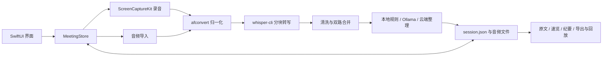

# MeetingScribe 审查报告 · 第 1 批

审查日期：2026-10-06（Asia/Shanghai）。范围：阶段 0–1，项目总览、架构、配置，以及首次发现的高风险异常与恢复路径。本报告是阶段报告，不代表全部功能、安全、性能和可访问性已经审完。

## 结论与问题索引

项目可以编译，已有实质性的单元测试和离线质量检查。当前最应优先修复的是**重新处理先销毁已有结果**，其次是恢复路径漏掉音频转换、文件存储错误被吞，以及异步开录期间没有互斥状态。无需整体重写：先保护数据与收紧任务状态，再逐步拆出可测试的服务接口。

本批共 8 项：P0 1 项、P1 4 项、P2 3 项。4 项通过运行复现；其余分别基于代码或安装产物检查。P0 的触发前提是失败记录中已有需要保留的逐字稿/人工校正/纪要；不表示每次正常录音都会丢数据。静默加载失败只证明记录从界面消失，不等同于磁盘文件被删除。

| ID | 优先级 | 类型 | 问题 | 证据状态 |
|---|---|---|---|---|
| BUG-001 | P0 阻断（条件性数据丢失） | Bug | 重新处理先清空已有逐字稿与纪要；失败不能回滚 | 隔离运行复现 |
| BUG-002 | P1 严重 | Bug | 重新处理跳过转换，原始 M4A 无法完成转写 | 真实引擎复现，并有转换后成功对照 |
| BUG-003 | P1 严重 | Bug / AI生成代码 | 草稿创建吞掉落盘错误，返回虚假的成功状态 | 隔离运行复现 |
| BUG-004 | P1 严重 | Bug / UX | 会话损坏或读取失败，被当作不存在而隐藏 | 隔离运行复现 |
| BUG-005 | P1 严重 | Bug / 架构 | 异步准备录音期间未锁定，允许再次开始或导入 | 代码确定；实际多路采集后果需验证 |
| UX-001 | P2 一般 | UX / AI生成代码 | 两路采集动画不反映真实音频输入 | 代码确定；断路表现待界面验证 |
| SEC-001 | P2 一般 | 安全 / 可维护性 | 分发审计未发现引擎中的私人绝对 LC_RPATH | 安装产物 + 当前审计脚本复现 |
| ARCH-001 | P2 一般 | 架构 / 可维护性 | Store 集中编排与同步 I/O，故障注入能力不足 | 结构确定；卡顿幅度未实测 |

## 审查基线与已执行验证

- GitHub：https://github.com/a916791360/MeetingScribe。
- 固定源码提交：`bd80e302b88622bb435eb73b47b34b847fb3f86f`，`main`，2026-09-17，版本 `0.11.1` / build `21`。
- 独立审查副本：`/Users/qingmeng/.codex/worktrees/meetingscribe-review/luyinzhuanxie`。
- 用户原源码目录仍停留在 `f2465d5`，没有合并或改写其源码。
- 已安装 App：`/Applications/MeetingScribe.app`；Info.plist 为 `0.11.1` / build `21`，与源码声明一致。**版本号相同不能证明二进制恰好来自同一提交。**
- 已读取安装 App 的窗口可访问性树，确认可见主界面、会议列表、三页导航、导出、播放与设置入口。本批没有进行完整 VoiceOver、键盘、对比度或截图验证。
- Swift 编译器：Apple Swift `6.3.3`，arm64，当前宿主 macOS 26；最低支持 macOS 15 上的运行情况尚未复测。
- `swift test --disable-sandbox -Xswiftc -warnings-as-errors`：290 项测试，1 项因未提供 `MS_E2E_KEY` 跳过，0 失败，编译通过。日志见 [baseline-swift-test.log](/Users/qingmeng/.codex/worktrees/meetingscribe-review/luyinzhuanxie/docs/reviews/2026-10-06/baseline-swift-test.log)。
- `python3 Scripts/tests/test_quality_report.py`：28 项通过。
- `python3 Scripts/quality_report.py --corpus docs/verification/quality/synthetic --check`：7 个 case 的预期与实测一致。这里验证的是指标识别行为，包含预期为“未达”的退化样本，**不能解释为全部生成内容达标**。
- 本批新增 4 项临时复现探针均成功捕获问题。它们断言的是“当前缺陷存在”，通过不表示应用正确。日志见 [batch-01-repro.log](/Users/qingmeng/.codex/worktrees/meetingscribe-review/luyinzhuanxie/docs/reviews/2026-10-06/batch-01-repro.log)，源码见 [ReviewBatch1ReproTests.swift](/Users/qingmeng/.codex/worktrees/meetingscribe-review/luyinzhuanxie/docs/reviews/2026-10-06/ReviewBatch1ReproTests.swift)。
- 复现只使用随机临时数据根与合成音频；涉及 Store 的探针备份并恢复所用 UserDefaults 键，没有读写真实会议，也没有发送云端请求或保存/删除钥匙串凭据。
- 临时探针已从正式测试目录移出，归档于此。业务源码和已安装 App 未修改；尚未实施修复。

## 项目结构与核心流程

| 层 / 职责 | 实际文件 | 本批判断 |
|---|---|---|
| 应用入口与窗口 | `MeetingScribeApp.swift`、`WindowConfiguration.swift` | SwiftUI WindowGroup，全窗口共用一个 MeetingStore |
| UI 与主题 | `WorkbenchView.swift`、`WorkbenchContentPlan.swift`、`AppTheme.swift` | 原文/速览/纪要三页；设置、导入、播放、逐字稿编辑均在同一 UI 文件内 |
| 状态、编排、存储 | `MeetingStore.swift` | @MainActor Store；同文件另有 SessionStorage 与本地分析构建器 |
| 数据契约 | `MeetingModels.swift` | Codable 会话、逐字稿、结构化结论、状态与权限模型；若干新增字段已有向后兼容解码 |
| 音频与进程 | `WhisperPipeline.swift`、`AudioTrackRecorder.swift` | ScreenCaptureKit 双来源录音、afconvert 归一化、whisper-cli 子进程 |
| 转写处理 | `TranscriptCleaner.swift`、`TranscriptMerger.swift`、`TranscriptEditor.swift`、`TranscriptMaterial.swift`、`Glossary.swift` | 术语替换、分段合并、材料门禁、人工编辑与来源标签 |
| 整理、模型与密钥 | `SummaryEngine.swift`、`SummaryModelDiscovery.swift`、`KeychainStore.swift` | 本地规则、Ollama、OpenAI 兼容服务；API Key 使用钥匙串 |
| 输出与回放 | `MeetingExport.swift`、`MinutesMarkup.swift`、`AudioPlayback.swift` | Markdown 导出、复制、时间跳转、回放 |
| 构建与交付 | `Package.swift`、`Packaging/`、`Scripts/`、`.github/workflows/quality.yml` | 单 SwiftPM executable target + test target，无第三方 Swift Package 声明；外部引擎与模型由脚本拷入 App |
| 测试与历史材料 | `Tests/MeetingScribeTests/`、`Scripts/tests/`、`docs/` | 32 个现有 Swift 测试文件；历史截图与审查材料不能替代本次重新验证 |

本项目是原生桌面应用，没有在已检代码中发现独立 Web 后端或关系型数据库。会话采用用户 Application Support 目录下的“每场会议一个目录 + session.json + 音频/分块文件”；模型配置与术语表在 UserDefaults，密钥在钥匙串。Web 登录、Cookie、CSRF、数据库事务不能直接套用，应重点审查本地文件边界、网络端点、进程与分发安全。

补充判断：API 与内部状态有明确的数据类型，尚未确认模块级循环依赖；仓库本身只有一个业务 target，因此不能以“单 target”直接断言存在循环依赖。保存 JSON 使用 `.atomic` 是有效保护，但不提供历史版本、跨步骤事务或失败回滚。已有 CI 执行 Swift 与 Python 检查；本批验证的是本机运行结果，未查询远程 CI 历史，也未重建完整发行包或验证公证。

## 逐项问题与修复验收

### BUG-001：重试销毁已有结果

| 字段 | 内容 |
|---|---|
| ID | BUG-001 |
| 类型 | Bug |
| 严重级别 | P0 阻断：条件性数据丢失 |
| 置信度 | 高 |
| 位置 | [MeetingStore.swift:1003](/Users/qingmeng/.codex/worktrees/meetingscribe-review/luyinzhuanxie/MeetingStore.swift:1003)，`retryProcessing`；关键清空在 1014–1016，写盘在 1028；失败页入口 `WorkbenchView.swift:587`、2577 |
| 问题描述 | 对已有内容的失败会议重新处理时，先把旧逐字稿、段数组、纪要全部清空并保存，随后才运行转写。转写失败后只有空结果，人工校正无法从原音频恢复；会话级 transcriptEditedAt 还会保留，形成旧校正标记与空正文的不一致。 |
| 证据 | `resetSession.transcriptText = ""`；`resetSession.transcriptSegments = []`；`resetSession.analysis = .empty`；`try storage.save(resetSession)` 在异步工作开始前执行。探针保存人工校正段与纪要，调用 retry 后立即读盘，结果均为空；令 CLI 失败后再次读盘仍为空。 |
| 影响 | 丢失已确认的人工文本与既有纪要。原始录音尚在，但不能还原人工修订；无历史快照或自动回滚。 |
| 复现步骤 | 1. 在临时目录保存一条 failed 会议，包含逐字稿、人工编辑标记、纪要与有效 WAV。2. 将测试 CLI 指向 `/usr/bin/false`。3. 调用 retryProcessing。4. 在任务开始前与失败后分别读 session.json，确认旧内容均已消失。对应探针 `testRetryErasesSavedManualEditsBeforeAnyTranscriptionRuns`。 |
| 建议修复 | 旧结果保持可读，重试结果写到独立 attempt 临时目录与候选会话；任务成功后一次原子替换“当前结果”。失败/取消保留旧版本。若用户选择丢弃人工修订，应提供独立、明确的操作与确认，并先保存可恢复版本。 |
| 验证方式 | 对失败记录分别注入 CLI 退出、模型丢失、转换失败、取消和写盘失败；旧逐字稿、人工标记、纪要逐字保持。成功后新版本一次提交，旧版本可恢复；界面不能误显示旧结果为本次新结果。 |
| 是否 AI 生成典型问题 | 是：先清状态再执行，没有失败回滚；不能仅凭代码模式证明作者使用了 AI。 |

### BUG-002：重试漏掉输入归一化

| 字段 | 内容 |
|---|---|
| ID | BUG-002 |
| 类型 | Bug |
| 严重级别 | P1 严重 |
| 置信度 | 高 |
| 位置 | [MeetingStore.swift:1005](/Users/qingmeng/.codex/worktrees/meetingscribe-review/luyinzhuanxie/MeetingStore.swift:1005)、1042，`retryProcessing`；输入选择 `processingInputURL:1534`；正常导入在 416 转换，启动恢复在 1439 按格式转换 |
| 问题描述 | failed 会议没有可用 input.wav 时，会选到原始 source.m4a 或 source.mov；retry 直接 process，没有正常导入/恢复中的转换步骤。转写无法通过。 |
| 证据 | `inputURL: inputURL` 被直接传给 process。探针使用系统工具生成合法 M4A，调用实际 retry 和已安装 whisper 引擎，得到 failed、inputAudioFileName 为 source.m4a、没有 input.wav，报“找不到 whisper 的 JSON 输出。”；同一 M4A 经 AudioTranscoder 转成 WAV 后，同引擎成功生成 JSON。 |
| 影响 | 转换阶段失败、原始录音因退出而中断、或中间 WAV 丢失后的恢复按钮不能完成核心任务。MOV 路径同样漏转换，但本批仅实测 M4A；其他格式后果需逐项验证。 |
| 复现步骤 | 1. 临时 failed 会议仅保留有效 source.m4a，没有 input.wav。2. 指定安装包里的 CLI 与模型。3. 点对应重新处理或调用 retryProcessing。4. 确认失败。5. 将同音频转 WAV，再调用同引擎，确认可生成输出。对应探针 `testRetryPassesOriginalM4AToTheInstalledWhisperEngine`。 |
| 建议修复 | 抽出统一 prepareInput，用于首次导入、重试与启动恢复。检查文件实际可解码性及已完成转换状态，输出到独立临时 WAV，验证成功后原子提交；不能只按扩展名或“文件存在”判断中间文件可用。 |
| 验证方式 | M4A/MOV/MP3/WAV 四类逐项覆盖“只有原始文件”“损坏中间文件”“转换被取消”“转换成功后重试”。转写前应取得有效 WAV，原始文件不改写；错误归因应明确到转换或转写。 |
| 是否 AI 生成典型问题 | 是：首次流程补齐，重试分支复制后遗漏关键步骤；AI 来源不确定。 |

### BUG-003：保存失败却返回成功草稿

| 字段 | 内容 |
|---|---|
| ID | BUG-003 |
| 类型 | Bug / AI生成代码 |
| 严重级别 | P1 严重 |
| 置信度 | 高 |
| 位置 | [MeetingStore.swift:1988](/Users/qingmeng/.codex/worktrees/meetingscribe-review/luyinzhuanxie/MeetingStore.swift:1988)，SessionStorage.init；2012，createDraftSession；2038 的 catch；调用方 startRecording:280、importAudio:387 |
| 问题描述 | 数据根创建失败使用 try? 忽略；草稿保存失败又被空 catch 吞掉。函数不返回 Error，只交回 status 为 recording 的对象，调用方无法知道草稿没有保存。 |
| 证据 | 注释声称“let the caller surface the error”，实际没有错误返回通道。探针让 rootURL 指向普通文件，仍返回 recording 草稿，磁盘无 session.json，随后按 ID 获取会话抛错。 |
| 影响 | 可能进入“正在准备录音/导入”后才失败，错误位置偏离真实原因；数据根不可写时，无法保证录音和会话元数据完整保存。没有证明此条件下采集一定持续成功，不能据此声称已录音丢失。 |
| 复现步骤 | 1. 临时目录建立一个普通文件。2. 将它作为 SessionStorage.rootURL。3. 创建 draft。4. 检查返回 recording，而 session.json 不存在。对应探针 `testDraftCreationReturnsSuccessWhenRootIsARegularFile`。 |
| 建议修复 | createDraftSession 改为 throws，目录与元数据都成功后才返回；调用方仅在成功后插入列表和启动采集。把初始化或首次写入错误明确呈现为“会议存储位置不可写”，给出可执行的恢复操作。 |
| 验证方式 | 文件占位、目录只读、权限错误、磁盘空间不足分别注入。都应得到准确错误，录音器未启动、未产生幽灵会议，后续合法操作仍可继续。 |
| 是否 AI 生成典型问题 | 是：注释描述了异常处理，但实现没有实现该契约。 |

### BUG-004：读取错误与空列表混为一谈

| 字段 | 内容 |
|---|---|
| ID | BUG-004 |
| 类型 | Bug / UX |
| 严重级别 | P1 严重 |
| 置信度 | 高 |
| 位置 | [MeetingStore.swift:1997](/Users/qingmeng/.codex/worktrees/meetingscribe-review/luyinzhuanxie/MeetingStore.swift:1997)，loadSessions；2117，loadSession；reloadSessions:214 |
| 问题描述 | 扫描数据根失败返回 []，JSON 读取/解码失败返回 nil，再经 compactMap 静默丢弃。用户看到空态或会议缺失，无法区分“没有记录”“没权限读”“一条记录损坏”。 |
| 证据 | `return try? decoder.decode(...)` 与 `items.compactMap`。探针先确认 1 条会议可读，把其 session.json 改成截断 JSON 后，loadSessions 变成 0 条，但文件仍存在。 |
| 影响 | 真实数据被隐藏，用户误以为会议消失，无法在 App 内定位故障、导出原始音频或恢复元数据。该证据不表示文件已经删除。 |
| 复现步骤 | 1. 临时目录创建合法会议。2. 将 session.json 写成 `{truncated`。3. 调 loadSessions 或重新打开使用该数据根的 App。4. 列表遗漏该记录，没有加载问题信息。对应探针 `testCorruptedSessionDisappearsWithoutLoadError`。 |
| 建议修复 | 返回 LoadResult(sessions, issues)，区分根目录失败和单条失败；对确有 session.json 的损坏会议保留恢复入口，展示路径与错误类别。模型目录等非会议目录正常跳过。添加 schemaVersion 和迁移失败保护，迁移前保留备份。 |
| 验证方式 | 混合正常、截断 JSON、字段类型错误、旧版本字段、不可读文件及 models 目录。正常记录照常显示；损坏会议可见且可定位；models 不误报警；扫描根失败不能展示“开始第一场会议”的正常空态。 |
| 是否 AI 生成典型问题 | 是：用 try? 与 compactMap 把错误伪装成无数据；AI 来源不确定。 |

### BUG-005：准备开录没有占用任务状态

| 字段 | 内容 |
|---|---|
| ID | BUG-005 |
| 类型 | Bug / 架构 |
| 严重级别 | P1 严重 |
| 置信度 | 高（互斥缺口）；中（实际多路采集与收尾后果） |
| 位置 | [MeetingStore.swift:263](/Users/qingmeng/.codex/worktrees/meetingscribe-review/luyinzhuanxie/MeetingStore.swift:263)，startRecording；异步 Task 在 307 创建，isRecording 在 311 才设；importAudio:376；`WorkbenchView.swift:493`、512、553 |
| 问题描述 | startRecording 只拒绝 isRecording/isProcessing，但两者直到 await recorder.start 完成后仍为 false。准备期间第二次开始录音或导入可以通过 guard，覆盖 activeSessionID、mixedSession。开录 Task 未保存，也没有操作 ID 校验，晚到回调会更新共享全局状态。 |
| 证据 | 方法内同步创建 draft 和 recorder，但 `isRecording = true` 位于异步成功分支。导入按钮仅据两个布尔值禁用，主按钮同样按两个布尔值判下一步。不是线程同时写内存，而是 MainActor 在 await 期间的逻辑交错。 |
| 影响 | 可出现多个草稿、会话与录音器错配、旧 Task 清掉新任务状态；是否留下实际录音未收尾取决于系统回调顺序，需用可控录音器或隔离实机验证。 |
| 复现步骤 | 需验证：1. 为录音器 start 注入可等待的假实现。2. 第一次 start 进入准备后保持挂起。3. 第二次 start 或 import。4. 放行旧 start 回调，检查会话数量、活动 ID 与录音器是否错配。当前实现没有录音器注入接口，未以真实会议触发。 |
| 建议修复 | 在第一个 await 前进入 preparing 状态，统一 busy 判定涵盖 preparing/recording/stopping/processing/cancelling；保存开录 Task 与 operationID，回调先核对是否仍属于当前操作。异常时只释放对应操作；录音启动应可取消并保证收尾。 |
| 验证方式 | 连点、准备期间导入/删除、启动失败、晚到成功、晚到失败等确定性顺序测试。只能建立一条有效采集会话；过期操作不能清除新状态；录音器 stop 恰好一次。 |
| 是否 AI 生成典型问题 | 是：把异步开始视为同步完成，仅覆盖正常路径；AI 来源不确定。 |

### UX-001：装饰动画被放在真实音源状态位置

| 字段 | 内容 |
|---|---|
| ID | UX-001 |
| 类型 | UX / AI生成代码 |
| 严重级别 | P2 一般；因误判录音完整性的潜在后果，建议与录音状态一同修 |
| 置信度 | 高 |
| 位置 | [WorkbenchView.swift:2772](/Users/qingmeng/.codex/worktrees/meetingscribe-review/luyinzhuanxie/WorkbenchView.swift:2772)，recordingBody；3022，WorkbenchCaptureSourceCard；3058–3081，WorkbenchLevelBars |
| 问题描述 | 麦克风与系统声音各显示一组活动柱，没有音频状态输入；柱高只取当前时间和 sin。静音或某路没样本也会动画。源卡没有把“活动动画”与“真实信号”区分，代码注释却声称表达“有信号在进来”。 |
| 证据 | WorkbenchLevelBars 无 recorder、sample、permission 或 level 参数；barHeight 使用 `date.timeIntervalSinceReferenceDate` 与 sin。两个来源卡都无条件实例化该 View。 |
| 影响 | 用户可能误以为两路都在采集，录完后才发现缺少自己或对方声音。这里只证明反馈没有依据，未证明当前安装 App 的某次实际录音缺路。 |
| 复现步骤 | 1. 在隔离录音测试中令某路无样本或静音。2. 观察该路柱形。3. 预期按现实现继续动画，与真实样本状态无关；本批未实机触发权限或真实录音。 |
| 建议修复 | 显示真实峰值/RMS、最近样本时间、静音与不可用状态；日志中的降级应进入 UI。接入前将动画改为清楚标注的通用“录音进行中”指示，别放在两路信号表的位置。补充 VoiceOver 可读状态与减少动态效果支持。 |
| 验证方式 | 静音、缺权限、设备拔出、只来一路样本、两路正常逐项验证；信号未确认时不能宣称有输入。状态不能只靠动画/颜色表达，读屏应能区分正常、静音、不可用。 |
| 是否 AI 生成典型问题 | 是：视觉完成但没有真实数据连接；不能仅此证明 AI 作者。 |

### SEC-001：审计通过与实际 Mach-O 路径不一致

| 字段 | 内容 |
|---|---|
| ID | SEC-001 |
| 类型 | 安全 / 可维护性 |
| 严重级别 | P2 一般 |
| 置信度 | 高（当前安装产物与审计盲区）；新构建发行包是否同样携带路径需验证 |
| 位置 | [audit_release.sh:32](/Users/qingmeng/.codex/worktrees/meetingscribe-review/luyinzhuanxie/Scripts/audit_release.sh:32)、57、78；`Scripts/package_app.sh:93` 原样拷贝引擎；安装包 whisper-cli 的 LC_RPATH |
| 问题描述 | 审计只做 strings 特征扫描和 dylib 自身的 otool -D，未检查可执行文件的 LC_RPATH 和所有依赖加载命令。当前安装引擎含开发机绝对 LC_RPATH，运行现有审计仍输出“无私人路径…依赖均为相对路径”。 |
| 证据 | `otool -l <installed whisper-cli>` 的 LC_RPATH 指向 `/Users/<开发者>/Documents/<私人项目>/.../whisper.cpp/build/bin`；当前脚本退出 0。完整取证见 installed-whisper-load-commands.log、installed-release-audit.log。 |
| 影响 | 私人目录信息随二进制传播，分发门禁提供错误保证，依赖可迁移性检查不完整。App 的进程包装器设置 DYLD_LIBRARY_PATH 可补偿当前库定位，所以**没有证据证明 App 内转写因该路径失败，也不是已经验证的远程代码执行漏洞**。 |
| 复现步骤 | 1. 对已安装 whisper-cli 跑 otool -l 并检查 LC_RPATH。2. 跑当前 Scripts/audit_release.sh /Applications/MeetingScribe.app。3. 对比绝对路径与“通过”输出。仅版本号相同不足以断言该产物就是 GitHub 当前提交打包结果。 |
| 建议修复 | 构建引擎时使用 @loader_path/@executable_path/@rpath 的可迁移配置；如用 install_name_tool 调整，必须在重新签名前进行。审计每个 Mach-O 的 otool -L、LC_RPATH 和自身 install name，显式允许系统路径，拒绝用户目录与构建目录；增加移动到临时目录后的 CLI 冒烟测试。 |
| 验证方式 | 用测试 Mach-O 分别植入私人 LC_RPATH、绝对依赖、相对路径、系统路径；前两项必须失败，合法项通过。最终包移到另一目录且不依赖开发机目录，验证 CLI 启动及一段合成音频转写。 |
| 是否 AI 生成典型问题 | 是：检查项看似完整，却没有覆盖声明的二进制元数据；AI 来源不确定。 |

### ARCH-001：编排与副作用集中，隔离不足

| 字段 | 内容 |
|---|---|
| ID | ARCH-001 |
| 类型 | 架构 / 可维护性（附性能风险） |
| 严重级别 | P2 一般，渐进式改进建议 |
| 置信度 | 高（依赖与同步调用事实）；中（对实际卡顿的影响） |
| 位置 | [MeetingStore.swift:21](/Users/qingmeng/.codex/worktrees/meetingscribe-review/luyinzhuanxie/MeetingStore.swift:21)、99–104、140、375、1983、2179；`WorkbenchView.swift`；`Package.swift:13` |
| 问题描述 | @MainActor Store 同时处理 UI、录音生命周期、文件复制、全量扫描/JSON 编解码、转写、摘要、设置与密钥访问。只注入了 SessionStorage，录音器、转换器、引擎、UserDefaults/Keychain 仍绑定具体实现，难以确定性测试启动/取消交错和 I/O 故障。 |
| 证据 | Store 2619 行、UI 4343 行；行数只是规模指标，问题依据是职责与依赖。importAudio 在 MainActor 方法中同步调用 copyImportedAudio；后者使用 FileManager.copyItem；reloadSessions 同步全量解码。主线程 I/O 确定存在，尚未测量耗时或内存峰值。 |
| 影响 | 故障注入成本高，状态回归容易漏测；大文件导入、大量历史会话可能阻塞交互（需性能验证）。现有小数据探针不足以证明实际严重卡顿。 |
| 复现步骤 | 结构检查即可确认依赖。性能需验证：以 100/1000 场合成会议和大音频建立隔离夹具，用 Instruments 记录启动与导入的主线程耗时及内存；禁止用真实会议测试破坏性故障。 |
| 建议修复 | 先引入小接口 RecordingSession/AudioPreparing/SessionRepository/SummaryAnalyzing 和明确 OperationState；将磁盘 I/O 移入串行 repository actor，UI 只发布状态与结果；配置采用可注入的 UserDefaults suite。按页面拆出设置、原文、纪要、录音状态视图，保留现有业务逻辑与测试，不要求换框架或数据库。 |
| 验证方式 | 能用假录音器精准控制 start/stop 回调，用失败 repository 验证保存/回滚，测试不依赖系统权限/真实 Keychain。现有测试保持通过；新增批量夹具下主线程不执行长时间文件复制/全量解码，状态切换可追踪。 |
| 是否 AI 生成典型问题 | 不确定；集中式实现也可能来自正常迭代。 |

## 建议修复顺序与验收清单

下面是本批排期建议，耗时为估算，不是已经完成的修复。

| 顺序 | 工作 | 预计范围 | 验收门 |
|---|---|---|---|
| 1 | BUG-001：重试结果候选写入、保留旧版本 | 先完成最小保护，再完善版本恢复 | 所有失败/取消情况下，人工校正与旧纪要不丢 |
| 2 | BUG-002：统一输入准备 | 约半天–1 天，取决于取消与临时文件管理 | 原始 M4A 对照由失败变为成功；MOV 等格式回归 |
| 3 | BUG-003 / BUG-004：存储错误显式传播 | 简单错误出口可在 1 天内完成；恢复 UI 另排 | 不可写时阻止开录；损坏会议可定位，不再伪装空态 |
| 4 | BUG-005：preparing 状态、操作 ID 与过期回调保护 | 约 1–2 天，需录音器测试接口 | 启动/失败/取消/导入交错用确定性测试覆盖 |
| 5 | UX-001：先撤销无依据的信号表述 | 简单反馈调整可在 1 天内完成；真实电平另排 | 未收到样本时不宣称有输入；读屏获得真实状态 |
| 6 | SEC-001：补 Mach-O 依赖检查并重测发行包 | 简单检查可在 1 天内完成 | 已安装问题产物审计应变红；修复后可迁移包变绿 |
| 7 | ARCH-001：分离副作用与任务状态 | 1–2 周内逐步拆出高风险服务，继续迭代 | 录音/文件/网络失败均可注入，主线程工作量有实测 |

- [ ] 原测试 290 项保留通过，并继续明确云端评测跳过原因。
- [ ] 重试失败/取消不清空旧结果，成功有原子提交与可恢复版本。
- [ ] 转换失败后重试、录音中退出后重试、损坏 input.wav 重试均可解释并恢复。
- [ ] 目录不可写/空间不足时不开录、不制造虚假成功草稿。
- [ ] JSON 损坏、旧 schema、不可读目录显示正确故障状态。
- [ ] 开录连点、导入交错、晚到回调不影响新任务。
- [ ] 采集反馈与真实样本一致，具有键盘与读屏可理解的状态。
- [ ] 最终 App 中所有 Mach-O 依赖和搜索路径都经验证；安装包版本与提交可追溯。

## 下一批范围与未验证边界

下一批建议聚焦录音 → 转换 → 分块转写 → 取消/恢复的完整状态空间，包括两路时间对齐、静音判断、输入完整性、进程超时与终止、删除活动会话、异常退出恢复和人工编辑保护。随后分别做 UI/可访问性、云端请求/端点/密钥、安全与分发、性能与维护性。

需后续验证：云端配置重启后 API Key 授权流程；摘要取消后立即再次整理的过期回调；会话元数据路径边界；模型自动发现与已有设置的优先级；提示词/输出与原文溯源；大数据与长录音性能；实际最低支持系统；完整发行包重建与许可证清单。它们目前是审查任务，不是本批已确认漏洞。

本批不需要用户再填写描述或上传文件。按用户约定，本批交付后确认是否继续，再进入下一批。
